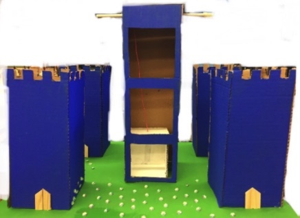

# moving-elevator
A mechanical elevator that is connected to an H-Bridge Motor, and programmed to change floor based on a user input value. The physical portion is hand-made, built using cardboard, a dowel and string. It uses a pulley system mechanism to generate movement of the box from the input that the user types on the computer.

